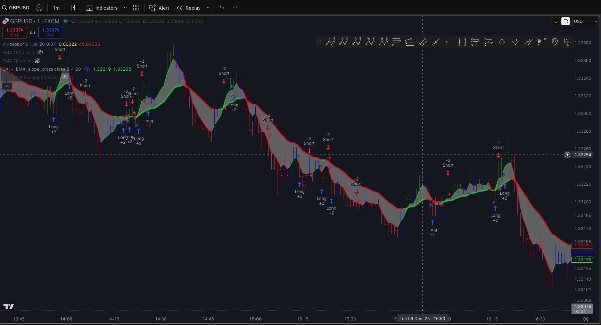
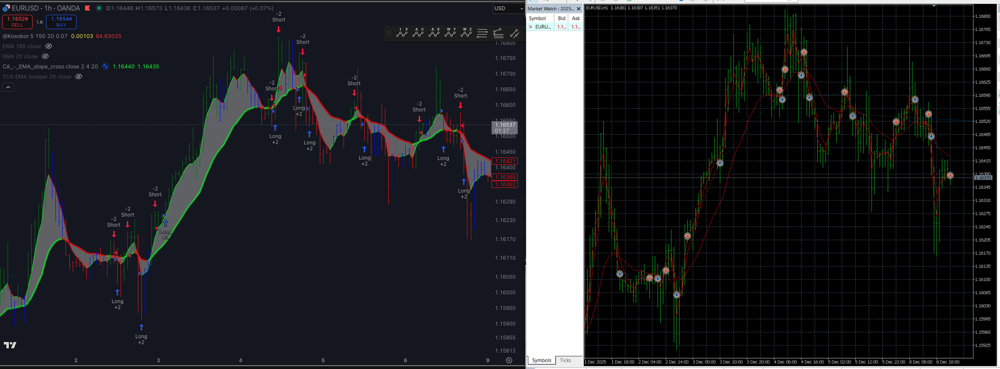
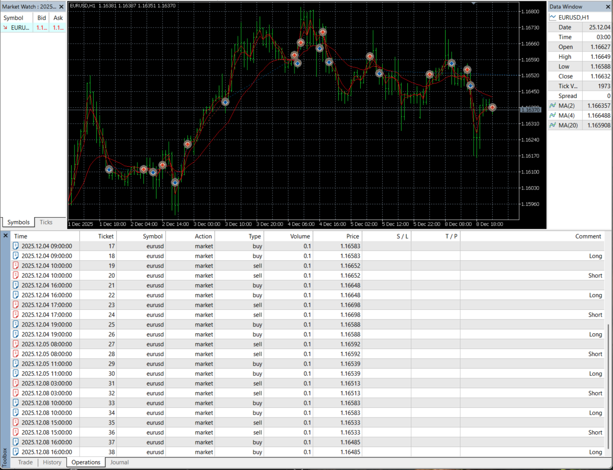
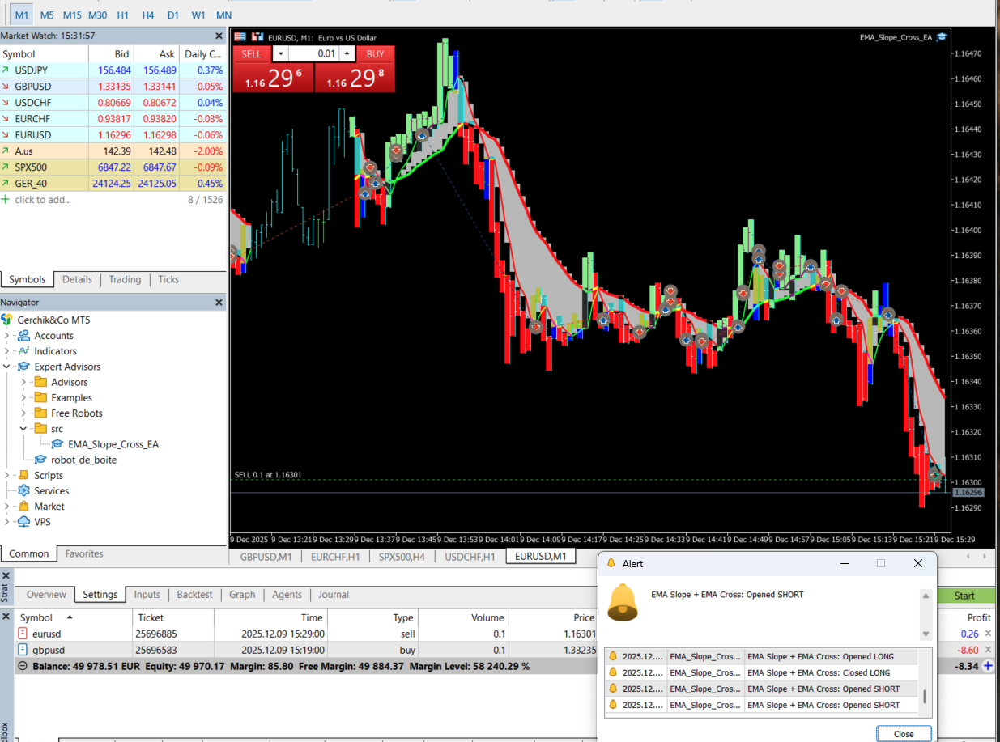
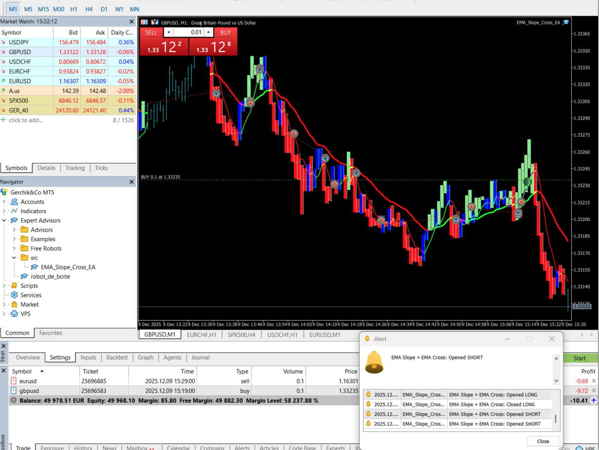
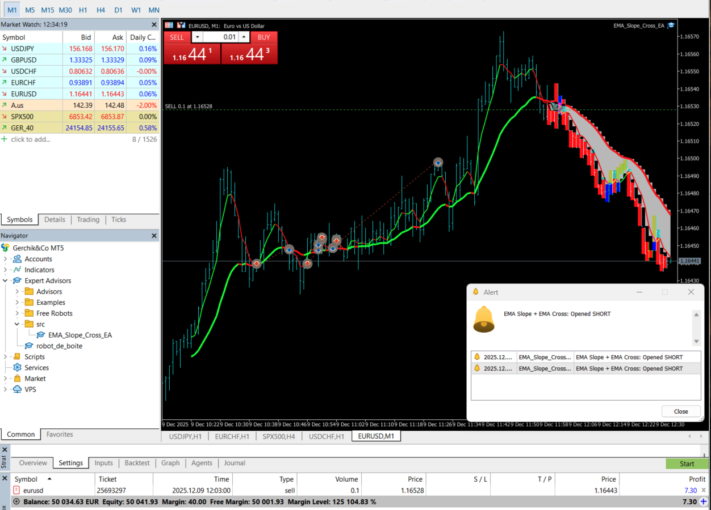

# Pine → MQL5 Conversion  
## EMA Slope + EMA Cross Strategy (by ChartArt)


This project is a full **TradingView → MT5 conversion** of the public Pine Script strategy  
**“EMA Slope + EMA Cross Strategy (by ChartArt)”**, rewritten **from scratch** in MQL5 with a modular, extensible architecture.

It reproduces all logic from the original Pine Script and adds several real–world trading features not available in the TradingView version.

---

# 🔷 Quick Summary

- Full conversion of TradingView strategy **Pine v3 → MQL5**  
- Clean modular architecture (6 modules)  
- Configurable timeframe, alerts, visualization  
- Optional non–“always in market” mode  
- Backtests + real-time charts included  
- Roadmap for Risk/MM + Python analytics (v2.0)  

---

# 1. Project Purpose

This repository demonstrates how a complex TradingView strategy can be **accurately translated** into a fully functional MetaTrader 5 Expert Advisor.

Included components:

- Indicator logic  
- Entry/exit conditions  
- Alert logic  
- Visualization  
- Strategy flow  
- Real-world trading improvements  

---

# 2. Original TradingView Strategy (Pine Script)

**Source:**  
https://www.tradingview.com/script/…

**Script:** *EMA Slope + EMA Cross Strategy*  
**Author:** ChartArt  

Original Pine Script file:  
`tradingview/original_script.pine`

### 📌 Core logic in Pine

- EMA(2), EMA(4), EMA(20)  
- Long/short conditions using slope + crossovers  
- Always in the market  
- Trend-based EMA colors  
- `alertcondition()` notifications  

### 📸 TradingView Signals



---

# 3. MT5 Conversion — Implemented Components

### ✔ EMA Calculations  
Using MQL5 `iMA()` or custom EMA module.

### ✔ Slope Detection  
`Close[i] - Close[i+1]` and EMA differentials.

### ✔ Cross Detection  
Accurate translation of `crossover()` / `crossunder()`.

### ✔ Position Management  
Full replication of Pine’s “reverse on signal” behaviour.

---

# 4. MT5 Enhancements (Beyond Original Pine Script)

## 1️⃣ Selectable Timeframe  
Operate independently from chart timeframe.  
Examples:  
- `0` → chart TF  
- `16385` → H1  
- `16408` → D1  

## 2️⃣ Signal-Based Trading  
(Disable “always in market”)  
- Opens only on valid LONG/SHORT signals  
- Auto-reversal on opposite signal  

## 3️⃣ Alerts  
- MT5 `Alert()` notifications  
- Entry/exit alert dispatching  
- Optional push notifications  

## 4️⃣ Visualization  
- EMA trend colors (green/red/blue)  
- Fill zone between EMA2/EMA3 (optional)  
- Bar coloring by slope  

## 5️⃣ Modular Architecture  
Located under `/src/modules`:

- [`ema_calc.mqh`](src/modules/ema_calc.mqh)  
- [`slope_calc.mqh`](src/modules/slope_calc.mqh)  
- [`DrawBar.mqh`](src/modules/DrawBar.mqh)  
- [`DrawEMA.mqh`](src/modules/DrawEMA.mqh)  
- [`alerts.mqh`](src/modules/alerts.mqh)  
- [`trade_executor.mqh`](src/modules/trade_executor.mqh)  

## 6️⃣ Market Closed Handling  
- Auto-retry on `ERR_MARKET_CLOSED (10018)`  
- Pending direction tracking for delayed entry  

---

# 5. Strategy Logic (MT5)

The EA mirrors TradingView logic.

---

## 🟩 Long Conditions

**A)** Price crosses under EMA3  
`crossunder(price, EMA3)`  

**OR**

**B)** All of:  
- `change(price) < 0`  
- `change(EMA1) < 0`  
- `crossunder(price, EMA1)`  
- `change(EMA2) > 0`  

---

## 🟥 Short Conditions

**A)** Price crosses above EMA3  
`crossover(price, EMA3)`  

**OR**

**B)** All of:  
- `change(price) > 0`  
- `change(EMA1) > 0`  
- `crossover(price, EMA1)`  
- `change(EMA2) < 0`  

---

## 📘 Position Management Summary

- Only 1 position is open at a time  
- Opposite signal ⇒ immediate reversal  
- Signals evaluated on every bar/tick  

---

# 6. Backtest & Real-Time Results

### 📈 Pine vs MT5 — Comparison  


### 🧪 MT5 Tester Output  
  


### 📡 Real-Time Examples  

EURUSD M1:  


GBPUSD M1:  


Alerts in action:  


---

# 7. File Structure

```text
/pine-to-mql5-ema-slope-cross/
│
├── src/
│   ├── EMA_Slope_Cross_EA.mq5
│   └── modules/
│       ├── ema_calc.mqh
│       ├── slope_calc.mqh
│       ├── alerts.mqh
│       ├── DrawBar.mqh
│       ├── DrawEMA.mqh
│       └── trade_executor.mqh
│
├── tradingview/
│   └── original_script.pine
│
├── screenshot/
│   ├── comparison_of_results_Pine_MT5.png
│   ├── mt5_chart_real_with_alerts.png
│   ├── testers_work_MT5.png
│   ├── testers_work_MT5_with_results.png
│   ├── mt5_chart_real_EURUSD_1m.png
│   ├── mt5_chart_real_GBPUSD_1m.png
│   └── TrView_chart_real_GBPUSD_1m.png
│
├── docs/
│   ├── logic_diagram.md
│   └── architecture_overview.md
│
└── README.md
```
---

# 8. How to Use

1. **Copy** the EA folder to:  
   `MQL5/Experts/pine_to_mql5_ema_slope_cross/`

2. **Compile** the EA inside **MetaEditor**.

3. **Attach** the EA to any chart (any symbol / any timeframe).

4. **Configure input parameters:**

### ⚙️ EMA Settings  
- `MA1_Length` — Fast EMA (default: 2)  
- `MA2_Length` — Mid EMA (default: 4)  
- `MA3_Length` — Slow EMA (default: 20)  

### 🔧 Trading Parameters  
- `Timeframe` — 0 = chart TF, 16385 = H1, 16408 = D1  
- `MagicNumber` — identifier for trades  
- `LotSize` — fixed lot size (default: 0.1)

### 🎨 Visualization  
- `ShowBarColor` — color bars by EMA slope  
- `ShowMovingAverages` — draw EMA lines  
- `ShowFillArea` — fill between EMA2 and EMA3  

### 🔔 Alerts  
- `SendAlerts` — enable/disable entry/exit alerts  

5. **Run a backtest** in Strategy Tester or test live on a demo account.

---

# 9. Roadmap — Planned for v2.0

Planned improvements for the next major release:

### 📌 Risk & Money Management  
- ATR-based stop loss  
- Dynamic lot sizing (risk % model)  
- Volatility-adjusted exit logic  

### 📌 Multi-Symbol Trading  
- Ability to manage multiple symbols from a single EA  
- Shared or independent signal logic options  

### 📌 Python Analytics Module  
- Automated trade reporting  
- Equity curve, drawdown, risk metrics  
- Export to CSV/JSON/PDF  

These features will evolve the EA into a complete professional trading framework.

---

# 10. License & Attribution

This project is intended for educational and demonstration purposes.

- Original TradingView idea & Pine Script belong to **ChartArt**.  
- All MQL5 code is a **clean-room implementation**, written independently from scratch.  
- Licensed under the **MIT License** (see the `LICENSE` file).  

---

# 11. Author

**Maxime**  
FinTech Developer · MT5 Automation · Trading Strategy Engineer  

Specialized in:  
- TradingView → MT5 conversions (Pine Script → MQL5)  
- Custom Expert Advisors for algorithmic trading  
- Multi-timeframe signal architectures  
- Python analytics & reporting tools  

💬 **Need to convert a TradingView strategy to MT5?**  
This repository demonstrates the exact engineering workflow and quality I deliver.  
Feel free to contact me for custom development.

---
