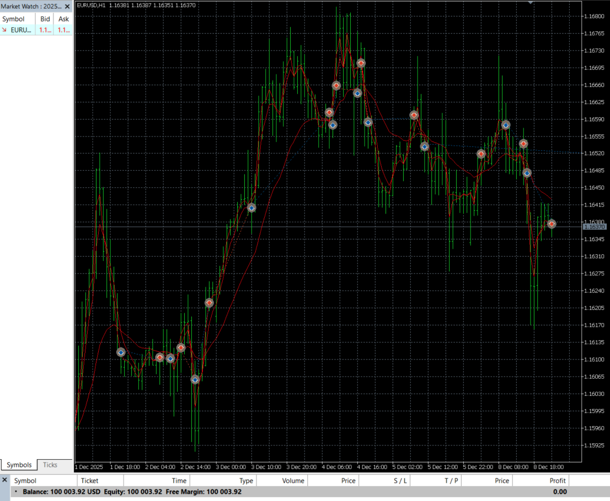

# Pine → MQL5 Conversion  
## EMA Slope + EMA Cross Strategy (ChartArt)

A complete TradingView-to-MT5 conversion project with structural enhancements, modular architecture, improved visualization, and MT5 backtests.

This repository reproduces the original TradingView strategy  
**“EMA Slope + EMA Cross Strategy (by ChartArt)”**  
and extends it with practical, production-level MQL5 engineering features.

---

# 🌟 Features at a Glance
- Clean modular architecture  
- Selectable trading timeframe  
- Magic number for multi-symbol trading  
- Optional non-“always in market” mode  
- Alerts on entries/exits  
- Visualization matching TradingView version  
- Backtest & real-time screenshots included  
- Risk & money management modules **planned** for v2.0  

---

# 1. Project Purpose

This project demonstrates how a real TradingView strategy can be **accurately translated into MT5**, including:

- indicator logic  
- entry conditions  
- alert conditions  
- visualization  
- strategy flow  
- market entry/exit behavior  

In addition, several practical features were added to the MT5 version that are not present in the original Pine Script.

---

# 2. Original TradingView Strategy (Pine Script)

**Source:**  
https://www.tradingview.com/script/…  

**Author:** ChartArt  
**Script name:** *EMA Slope + EMA Cross Strategy*  

You can find the original Pine file in:  
`/tradingview/original_script.pine`

### 📌 Core logic in Pine:
- EMA(2), EMA(4), EMA(20)  
- Long/short conditions using slope + crossovers  
- Always in the market  
- Trend-colored EMAs  
- `alertcondition()` signals  

### 📸 TradingView Signals


---

# 3. MT5 Conversion — Implemented Components

### ✔ EMA calculations  
Using MQL5 native `iMA()` or custom EMA module.

### ✔ Slope detection  
`Close[i] - Close[i+1]` and EMA differential.

### ✔ Cross detection  
Pine’s `crossover` / `crossunder` mapped to MQL5 logic.

### ✔ Position management  
Full replication of `strategy.entry()` behavior.

---

# 4. MT5 Enhancements (beyond original Pine Script)

## 1️⃣ Selectable Timeframe  
Works on any timeframe independent of chart TF  
Values: `0` (chart), `16385` (H1), `16408` (D1)

## 2️⃣ Signal-Based Trading  
(Optionally disable “always in market”)  
- Opens only when LONG/SHORT signals appear  
- Reverses automatically on opposite signal  

## 3️⃣ Configurable Alerts  
- MT5 `Alert()`  
- Entry/exit alerts  
- Optional push notifications  

## 4️⃣ Enhanced Visualization  
- EMA trend coloring (green/red/blue)  
- Optional fill area between EMA2 and EMA3  
- Bar coloring based on slope  

## 5️⃣ Modular Architecture  
Located under `/src/modules/`:
- `ema_calc.mqh` — EMA calculations  
- `slope_calc.mqh` — Slope & cross detection  
- `DrawBar.mqh` — Bar coloring  
- `DrawEMA.mqh` — EMA plotting  
- `alerts.mqh` — Alert management  
- `trade_executor.mqh` — Position execution logic  

## 6️⃣ Market Closed Handling  
Automatic retry when market is closed (`error 10018`).  
Pending direction is tracked for delayed entries.

---

# 5. MT5 Strategy Logic

The EA logic mirrors TradingView.

---

## 🟩 Long Conditions  
A) **Price crosses under EMA3**  
`crossunder(price, EMA3)`  
**OR**  
B) All of:
- change(price) < 0  
- change(EMA1) < 0  
- crossunder(price, EMA1)  
- change(EMA2) > 0  

## 🟥 Short Conditions  
A) **Price crosses above EMA3**  
`crossover(price, EMA3)`  
**OR**  
B) All of:
- change(price) > 0  
- change(EMA1) > 0  
- crossover(price, EMA1)  
- change(EMA2) < 0  

---

## 📘 Position Management

- Opens only when LONG or SHORT condition is met  
- If the opposite signal appears → current position is closed and reversed  

---

# 6. Backtest Results

### 📈 Comparison of Pine vs MT5  


### 🧪 MT5 Tester (Report)  
  


### 📡 Real-Time Examples  
EURUSD M1  


GBPUSD M1  


Alerts in action:  


---

# 7. File Structure
``` text
/pine-to-mql5-ema-slope-cross/
│
├── src/
│   ├── EMA_Slope_Cross_EA.mq5
│   └── modules/
│       ├── ema_calc.mqh
│       ├── slope_calc.mqh
│       ├── alerts.mqh
│       ├── DrawBar.mqh
│       ├── DrawEMA.mqh
│       ├── trade_executor.mqh
│
├── tradingview/
│   └── original_script.pine
│
├── screenshot/
│   ├── comparison_of_results_Pine_MT5.png
│   ├── mt5_chart_real_with_alerts.png
│   ├── tester's_work_MT5.png
│   ├── tester's_work_MT5_with_results.png
│   ├── mt5_chart_real_EURUSD_1m.png
│   ├── mt5_chart_real_GBPUSD_1m.png
│   └── TrView_chart_real_GBPUSD_1m.png
│
├── docs/
│   ├── logic_diagram.md
│   ├── architecture_overview.md
│
└── README.md
```
---


# 8. How to Use

1. Copy the folder into:  
   `MQL5/Experts/src/`

2. Compile the EA inside **MetaEditor**.

3. Attach the EA to a chart.

4. Configure input parameters:

   **EMA Settings**
   - `MA1_Length` — Fast EMA (default: 2)  
   - `MA2_Length` — Mid EMA (default: 4)  
   - `MA3_Length` — Slow EMA (default: 20)  

   **Trading**
   - `Timeframe` — 0 = chart TF, 16385 = H1, 16408 = D1  
   - `MagicNumber` — trade ID for this EA (default: 123456)  
   - `LotSize` — fixed lot size (default: 0.1)  

   **Visualization**
   - `ShowBarColor` — color bars by EMA slopes  
   - `ShowMovingAverages` — draw EMA lines  
   - `ShowFillArea` — fill area between EMA2 and EMA3  

   **Alerts**
   - `SendAlerts` — enable/disable MT5 alerts on entries/exits  

5. Run backtest in Strategy Tester or use on a demo account for forward testing.

---

# 9. Roadmap — Planned for v2.0

- Risk management module — customizable exit rules (TP/SL via EMA or volatility filters)  
- Money management module — dynamic lot sizing based on risk percentage  
- ATR-based stop loss integration  
- Multi-symbol trading support  
- Python module for automated reporting and trade analytics  

---

# 10. License & Attribution

This project is for educational and demonstration purposes.  
Original idea and Pine Script belong to **ChartArt (TradingView)**.  
All MT5 code is written from scratch as a clean-room implementation.

This repository is distributed under the **MIT License**.  
See the `LICENSE` file for details.

---

# 11. Author

**Maxime**  
FinTech Developer · MT5 Automation · Trading Strategy Engineer  

Specialized in:
- TradingView → MT5 conversions (Pine Script → MQL5)  
- Expert Advisor development for MetaTrader 5  
- Algorithmic strategy engineering  
- Python analytics for trade reporting and automation  

💬 **Need to convert your TradingView script to MT5 or build a custom EA?**  
This project demonstrates the exact workflow and engineering quality I provide.  
Feel free to contact me with your requirements.


